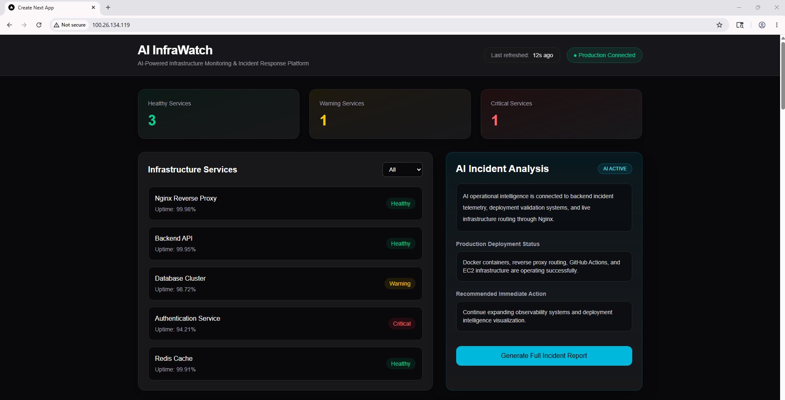
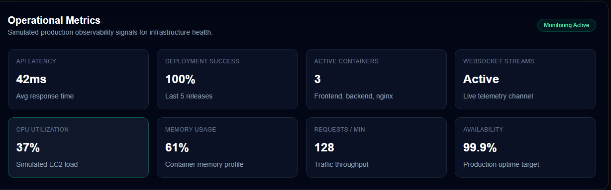
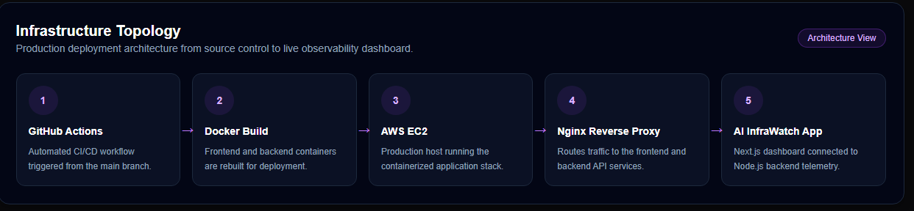
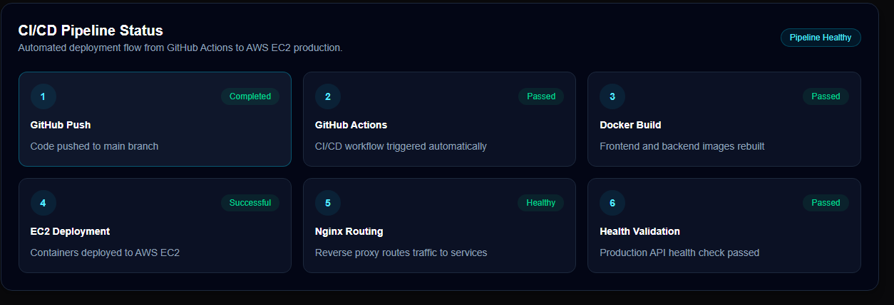
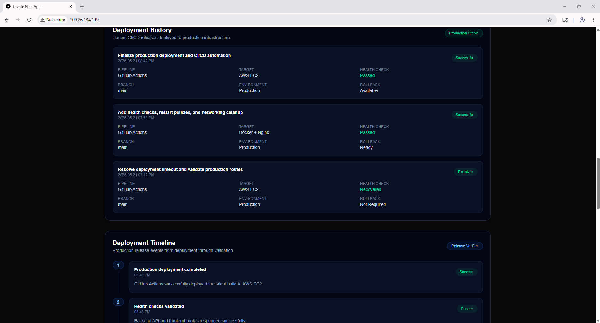
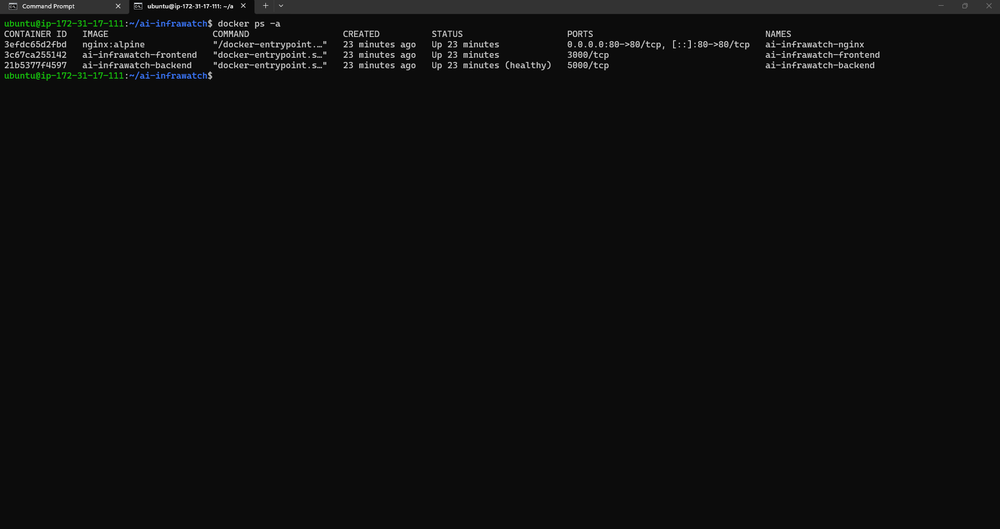
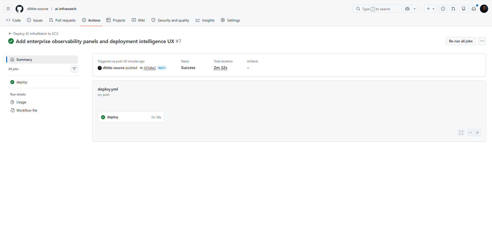

# AI InfraWatch

AI InfraWatch is an AI-powered infrastructure monitoring and deployment intelligence platform designed to simulate a modern enterprise observability environment.

The platform demonstrates real-world DevOps engineering concepts including:

- Dockerized frontend/backend services
- Nginx reverse proxy architecture
- AWS EC2 production deployment
- GitHub Actions CI/CD automation
- automated health validation
- operational observability dashboards
- deployment telemetry
- AI-driven incident analysis
- infrastructure topology visualization
- production monitoring UX systems

This project was built to showcase production-style DevOps workflows, infrastructure automation, and operational visibility in a cloud-native deployment environment.

---

# Production Features

## Infrastructure Monitoring
- Live infrastructure service monitoring
- health status indicators
- uptime visualization
- operational metrics dashboard
- infrastructure telemetry stream

## AI Incident Analysis
- AI-powered operational analysis panel
- simulated production incident workflows
- remediation recommendations
- impacted infrastructure visualization
- operational recovery guidance

## Deployment Intelligence
- deployment history tracking
- deployment timeline visualization
- CI/CD pipeline visibility
- production release validation
- infrastructure deployment observability

## Enterprise Observability UX
- operational metrics cards
- topology architecture visualization
- deployment lifecycle tracking
- cinematic monitoring atmosphere
- production-style observability design

---

# Infrastructure Architecture

## Production Stack

```text
GitHub Actions
        ↓
Docker Containers
        ↓
AWS EC2
        ↓
Nginx Reverse Proxy
        ↓
Next.js Frontend + Node.js API
```

## Core Technologies

### Frontend
- Next.js
- React
- TypeScript
- Tailwind CSS

### Backend
- Node.js
- Express.js

### Infrastructure
- Docker
- Docker Compose
- Nginx
- AWS EC2
- Ubuntu Linux

### CI/CD
- GitHub Actions
- automated deployment workflows
- automated container rebuilds
- deployment validation checks

---

# CI/CD Deployment Pipeline

AI InfraWatch uses GitHub Actions to automate production deployments to AWS EC2.

## Deployment Workflow

```text
Developer Pushes Code
        ↓
GitHub Actions Triggered
        ↓
Docker Images Rebuilt
        ↓
Containers Redeployed
        ↓
Nginx Routing Validated
        ↓
Health Checks Executed
        ↓
Production Deployment Completed
```

## Automated Deployment Features

- automatic GitHub Actions deployment
- EC2 deployment automation
- Docker container rebuilds
- production health checks
- deployment validation
- operational deployment verification

---

# Dockerized Services

The platform uses a multi-container architecture.

## Containers

### Frontend Container
- Next.js production application
- containerized React frontend

### Backend Container
- Node.js Express API
- telemetry and infrastructure APIs

### Nginx Container
- reverse proxy routing
- frontend/backend traffic management
- production request routing

---

# Nginx Reverse Proxy

Nginx acts as the production reverse proxy layer.

## Responsibilities

- frontend routing
- backend API proxying
- request forwarding
- production traffic management
- operational request handling

## Routing Flow

```text
Client Request
      ↓
Nginx Reverse Proxy
      ↓
Frontend or Backend Service
```

---

# AWS EC2 Production Deployment

The application is deployed on AWS EC2 using Docker Compose.

## Production Deployment Features

- Dockerized production services
- multi-container orchestration
- health validation
- restart policies
- operational runtime monitoring
- production deployment automation

## Infrastructure Validation

The deployment includes:

- running production containers
- validated API routing
- successful CI/CD deployment
- production monitoring systems
- operational telemetry verification

---

# Operational Monitoring

AI InfraWatch simulates enterprise-grade observability systems.

## Monitoring Features

- API latency tracking
- deployment success monitoring
- active container visibility
- WebSocket telemetry simulation
- CPU utilization metrics
- memory usage visualization
- throughput monitoring
- availability metrics

## Observability Components

### Operational Metrics Panel
Displays infrastructure telemetry and simulated production metrics.

### Infrastructure Topology Panel
Visualizes production deployment architecture.

### CI/CD Status Panel
Displays deployment pipeline progression.

### Deployment History Panel
Tracks production deployment events.

### Deployment Timeline Panel
Shows operational deployment lifecycle progression.

---

# AI Incident Analysis

The platform includes an AI-powered operational analysis experience.

## Features

- incident investigation interface
- operational impact analysis
- probable root cause analysis
- remediation workflow simulation
- impacted infrastructure mapping

---

# Health Checks

The backend includes health validation endpoints for deployment verification.

## Example Health Endpoint

```bash
GET /api/health
```

## Health Validation Purpose

- deployment verification
- CI/CD validation
- operational monitoring
- infrastructure status confirmation

---

# Deployment Automation

GitHub Actions automates production deployments.

## Deployment Automation Includes

- GitHub-triggered deployments
- Docker rebuilds
- container restarts
- deployment verification
- infrastructure rollout validation

---

# Screenshots

## Main Dashboard


## Operational Metrics


## Infrastructure Topology


## CI/CD Pipeline Status


## Deployment History & Timeline


## Docker Containers Running on EC2


## GitHub Actions Deployment


---

# Local Development

## Clone Repository

```bash
git clone https://github.com/YOUR_USERNAME/ai-infrawatch.git
cd ai-infrawatch
```

## Install Dependencies

### Frontend

```bash
npm install
```

### Backend

```bash
cd backend
npm install
```

---

# Run Locally

## Start Backend

```bash
cd backend
npm run dev
```

## Start Frontend

```bash
npm run dev
```

---

# Docker Deployment

## Build Containers

```bash
docker compose build
```

## Start Containers

```bash
docker compose up -d
```

## Verify Containers

```bash
docker ps -a
```

---

# Production Deployment

## Push Changes

```bash
git add .
git commit -m "Production deployment update"
git push origin main
```

## GitHub Actions Deployment

The deployment pipeline automatically:

- rebuilds containers
- redeploys services
- validates health checks
- confirms production availability

---

# Future Improvements

## Planned Enhancements

- HTTPS + SSL
- custom domain
- real infrastructure telemetry
- Prometheus integration
- Grafana dashboards
- Kubernetes orchestration
- ECS/Fargate deployment
- alerting systems
- real-time WebSocket infrastructure streaming
- AI anomaly detection
- production logging stack
- distributed tracing

---

# Portfolio Value

This project demonstrates:

- DevOps engineering
- Docker containerization
- CI/CD automation
- AWS deployment workflows
- infrastructure monitoring
- reverse proxy architecture
- operational observability systems
- deployment validation strategies
- enterprise deployment thinking
- production systems design

---

# Author

Demarko Little

DevOps Engineer | AWS | Docker | CI/CD | AI Infrastructure Engineering

---